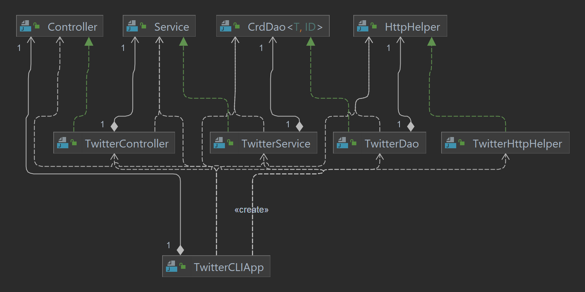
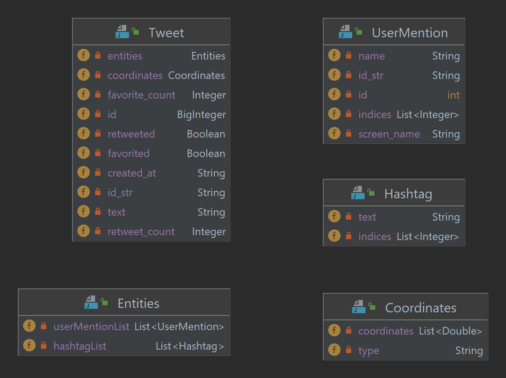

# Introduction
The Twitter API is a Java application that allows users to search, post, and
delete Tweets on their Twitter account from the command line (CLI).
The application uses an HTTP client to call the Twitter REST API. Spring and SpringBoot used to handle the dependencies management.
The application was built and packaged using Maven Tools. The application runs in a Docker container, and it is deployed using Docker and available on DockerHub.

# Quick Start
**Pre-requisites:** You need 4 keys/tokens obtained from your Twitter Developer Account.

1. Package the application using Maven:
```
mvn clean compile package
java -jar target/twitter-1.0-SNAPSHOT.jar show|post|delete [options]
```
2. Run the application with docker:
```
docker pull nisrein/twitter
docker run \
-e consumerToken=consumerToken \
-e consumerSecret=consumerSecret \
-e AccessToken=accessToken \
-e tokenSecret=accessSecret \
nisrein/twitter show|post|delete [options]
```

# Design
## UML diagram


## Components
##### Application layer:
This is the entry point of the application, it handles the arguments and passes them on to the controller, after checking that the
user has provided a valid argument.

##### Controller layer:
It is responsible for checking the number of the arguments that have been passed to the program if they are correct or not, then passing them to the service.


##### Service layer:
The service layer classes handled the business logic of the application. It is responsible to check if the tweet text exceeds 140 characters and if
longitude/latitude is out of range. And it checks if user input IDs are in the correct format. Then it calls the DAO layer.

##### DAO (Data Access Object) layer:
DAO layer classes only handle data with external storage. It is responsible for executing HTTP with a given URI,
and it authorizes the HTTP request using Twitter secrets. It is responsible for sending HTTP requests and receiving responses from the Twitter REST server.
It also handles unexpected server replies in case of errors. The final response is parsed into a JSON string and returned to the top layer.


## Models


## Spring
Spring was used to solve the Dependency management (DM) problem. When we have many components and each one requires more than one dependency,
it will become extremely hard to manage them, so to manage dependencies automatically, the Spring framework was applied with Spring Boot which injects dependencies automatically based on simple class annotations.

# Test
The application has been tested using Junit4. Unit and integration tests were written for each individual layer to check that
the functionality of the system was operational.

## Deployment
* Maven was used to package the project with all the dependencies required to run the application.
* Docker file was created to build a new docker image from the openjdk:8-alpine.
* Then the application was deployed on DockerHub.

# Improvements
1. Add feature allows us to post a photo.
2. Add a feature to search for a user by username.
3. Make the Tweet length more than 140 characters.