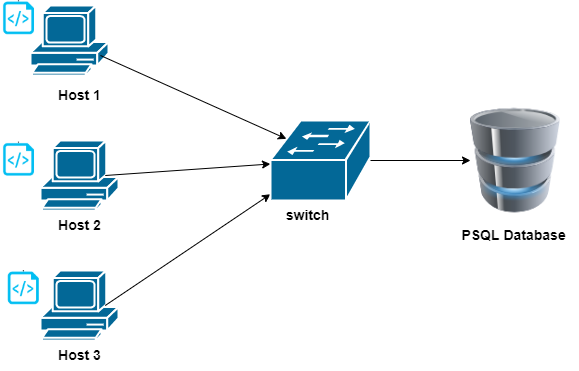

# Linux Cluster Monitoring Agent
This project is to manage  and monitor nodes of a 
Linux cluster. This project will help us to record the hardware
specifications of each node and monitor node resource usages 
in real-time and stores the data in a database.

The technologies that used in this project are:
* GIT
* PSQl
* Docker
* Bash Scriot
* IntelliJ IDEA
* Jarvis Remote Desktop (JRD)
* Google Cloud Platform (GCP)


# Quick Start
* Start a psql instance using psql_docker.sh

`./scripts/psql_docker.sh start`

* Create tables using ddl.sql

```psql -h localhost -U postgres -d host_agent -f sql/ddl.sql```

* Insert hardware specs data into the DB using host_info.sh

`./scripts/host_info.sh psql_host psql_port db_name psql_user psql_password`

* Insert hardware usage data into the DB using host_usage.sh

`./scripts/host_usage.sh psql_host psql_port db_name psql_user psql_password`

* Crontab setup

```
#edit crontab jobs
bash> crontab -e
#add this to crontab 
* * * * * bash full_path_to/host_usage.sh psql_host psql_port
 db_name psql_user psql_password > /tmp/host_usage.log
```

# Implemenation
To implement this project, first we have to c to set up a PSQL instance using Docker.
Then, using Bash script we will collect the hardware information and the 
resource usage. Then, create ddl script to help us create tables to store hardware specifications
and to resource usage data.
Finally, using SQL queries we can get the requested information from the 
database.

## Architecture


## Scripts
* psql_docker.sh: Shell script to create, start, or stop the
PostgreSQL Docker container.


* host_info.sh: Shell script  to get hardware specifications data of the host
and then insert the data into the database.


* host_usage.sh: Shell script to get resource usage of the host
and then insert the data into the database.


* crontab: used to run the script periodically.


* ddl.sql: create tables to store the data that obtained
from host_info.sh and host_usage.sh.


* queries.sql: contains some SQL queries.

## Database Modeling
The Database contains two tables that are used to store the following data:

**host_info table:**

 | **Column** | **Type** |
 |----------| --- |
 | id | SERIAL   |
 | hostname | VARCHAR  |
 | cpu_number | INTEGER  |
 | cpu_architecture | VARCHAR  |
 | cpu_model | VARCHAR  |
 | cpu_mhz | FLOAT    |
 | L2_cache | INTEGER  |
 | total_mem | INTEGER  |
 | timestamp | TIMESTAMP |


**host_usage table:**

| **Column** | **Type** |
|----------| --- |
| timestamp | TIMESTAMP   |
| host_id | SERIAL  |
| memory_free | INTEGER  |
| cpu_idle | INTEGER  |
| cpu_kernel | INTEGER  |
| disk_io | INTEGER    |
| disk_available | INTEGER  |


# Test
* The bash scripts were tested manually using command line. 
* The SQL queries were tested using sample data to ensure that the result are correct.

# Deployment
All the script files were deployed from the JRD to GitHub. 
And used Docker to provision the PostgreSQL database.

# Improvements

1. Add more SQL queries to test the script.
2. Add more tables for other information.
3. Add more sample data and test the SQL queries.


